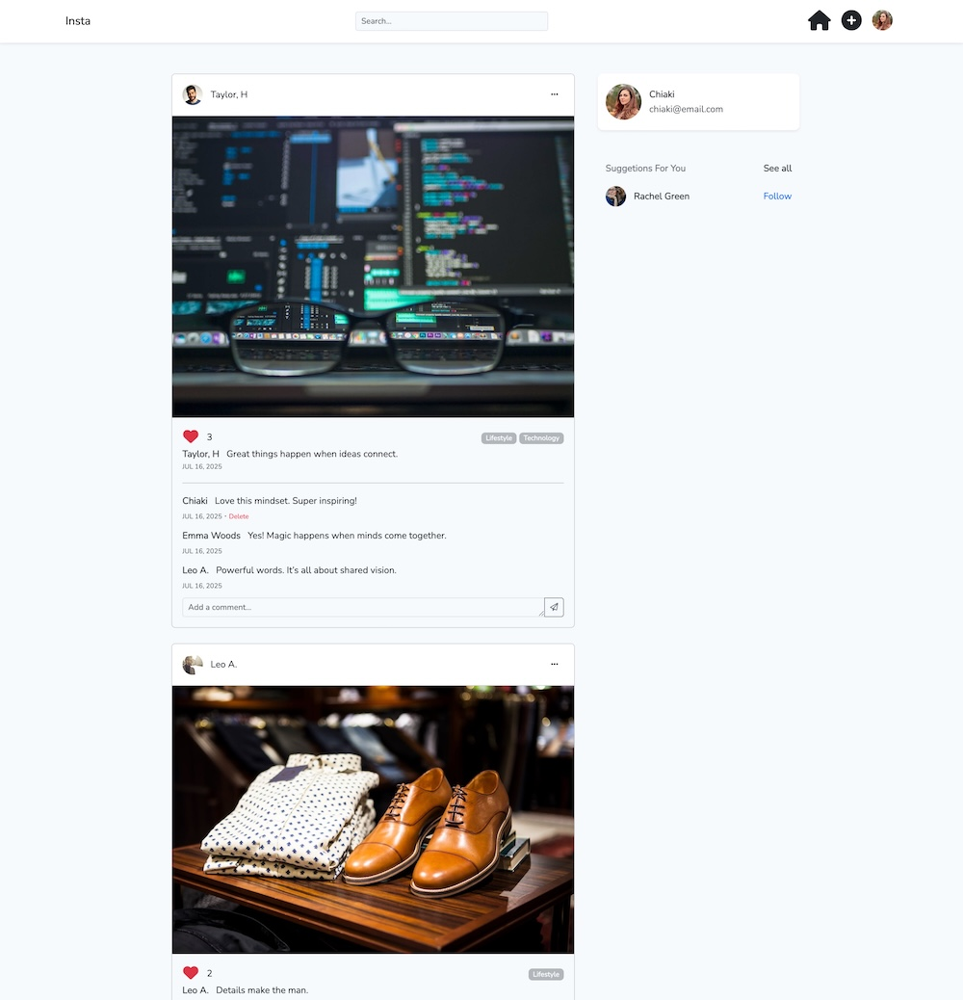
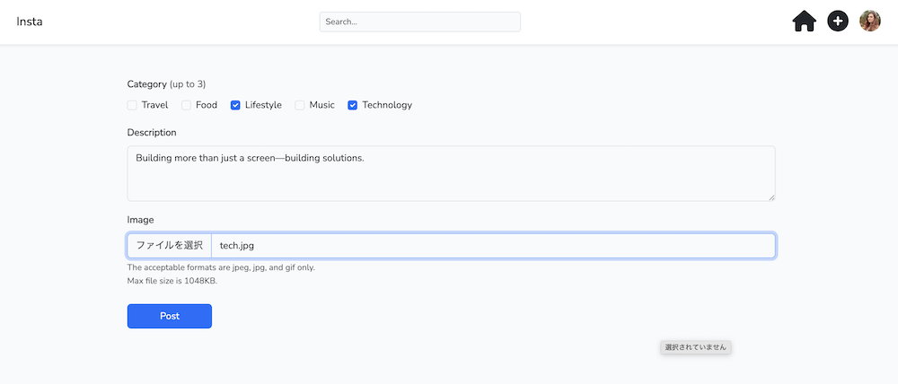
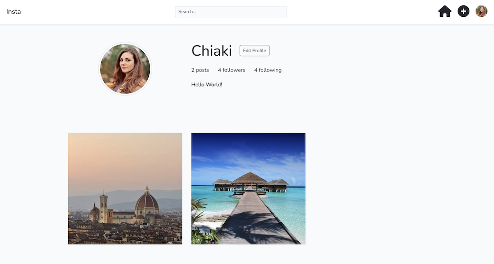
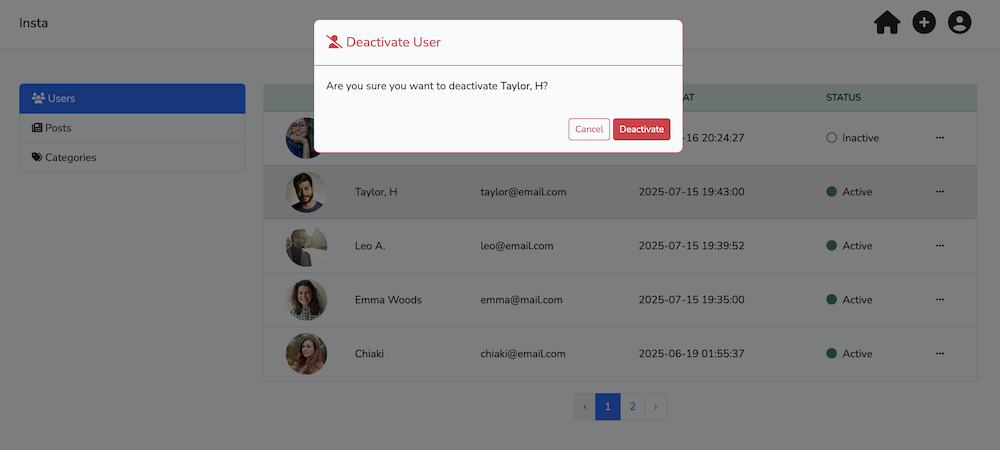

# Instagram Clone App (Built with Laravel)

This is a clone application that replicates core features of Instagram.  
It was developed using Laravel under the guidance of an instructor during an online course.  
The project focuses on mastering web application fundamentals and understanding the MVC architecture.

## Features

- User registration and login (authentication)
- Create, edit, and delete posts (with image upload)
- Post listing, search, and detail pages
- Follow/unfollow other users
- Timeline view
- Profile edit
- Like feature
- Comment feature
- Admin post management (edit/delete)

## Technologies Used

- Framework: Laravel 11.x
- Frontend: Blade template, Bootstrap
- Database: MySQL
- Authentication: Laravel UI (login, logout, user registration)
- Development environment: MAMP
- Others:
  - Eloquent ORM
  - Validation
  - PHP 8.4.7
  - Base64 encoding used for image upload, update, and display

## Local Setup

Clone the repository and perform basic Laravel setup to run the project

## Screenshots

### Timeline
### タイムライン

Timeline view: Displays posts from followed users in chronological order
タイムライン画面：フォロー中ユーザーの投稿が一覧表示されます
The timeline shows the latest posts from users you follow. Each post includes an image, caption, like button, and comments—offering a core social media experience.
ユーザーがフォローしている他のユーザーの投稿が、最新順にタイムラインとして表示されます。画像・テキスト・「いいね」・コメント機能など、SNSの基本要素を一画面で確認できます。

### Post Creation
### 投稿作成画面

Post Creation Page: Create posts with category, image, and body content
投稿作成ページ：カテゴリー・画像・本文を含む投稿が可能
Logged-in users can create posts by entering a category, body content, and an image. Created posts can be viewed on the user's profile page or in the post list, and can be edited or deleted at any time.
ログインユーザーは、カテゴリー・本文・画像を入力して投稿を作成できます。作成した投稿は、マイページや投稿一覧画面で確認でき、後から編集や削除も可能です。

### Profile
### プロフィール画面

Profile screen: Shows user bio, posts, and follower stats
プロフィール画面：投稿一覧と自己紹介、フォロワー情報を表示
The profile page displays the user's bio, number of posts, followers, and following. Users can view their post history and edit their profile details from this screen.
ユーザーのプロフィールでは、自己紹介文、投稿数、フォロワー数、フォロー数が表示され、自身の投稿の一覧も閲覧可能です。プロフィール編集にも対応しています。

### Admin Dashboard
### アドミン管理画面

Admin Panel: Centralized management of users, posts, and categories
管理者画面：ユーザー・投稿・カテゴリーをまとめて管理
The admin dashboard allows administrators to view all users and posts, and toggle their visibility. Categories can also be added or edited. This interface is designed for managing user activity and moderating inappropriate content effectively.
管理者専用のダッシュボードから、ユーザーや投稿を一覧表示し、表示・非表示の切り替えが可能です。カテゴリーの追加・編集にも対応しており、不適切な投稿への対処や全体の管理に活用できます。

# Instagramクローンアプリ（Laravel製）

このアプリは、Instagramの基本機能を模倣したSNSクローンアプリです。Laravelを使用して構築され、オンラインレッスンで講師の指導のもとそれぞれの機能を実装しました。主にWebアプリケーション開発の基礎とMVCの理解を目的としています。

## 主な機能

- ユーザー登録・ログイン（認証機能）
- 投稿の作成・編集・削除（画像アップロード対応）
- 投稿の一覧表示、検索、個別詳細ページ
- ユーザー同士のフォロー機能
- タイムライン表示
- プロフィール画面の編集
- 「いいね（Like）」機能
- コメント機能
- 管理者による編集・削除機能

## 使用技術

- フレームワーク：Laravel 11.x
- フロントエンド：Bladeテンプレート、Bootstrap
- データベース：MySQL
- 認証機能：Laravel UI（ログイン・ログアウト・ユーザー登録）
- 開発環境：MAMP
- その他：
    - Eloquent ORM
    - バリデーション
    - PHP 8.4.7
    - 画像データのアップロード、更新、表示にBase64エンコードを活用

## セットアップ方法（ローカル環境）

このリポジトリをクローンし、Laravelの基本的なセットアップ（依存パッケージのインストールや環境設定）を行うことで動作します。